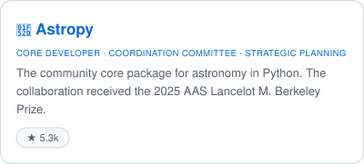
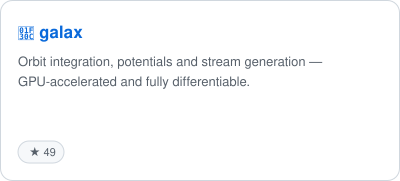
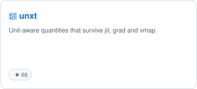
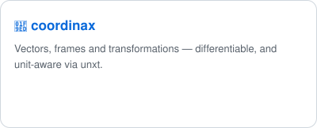
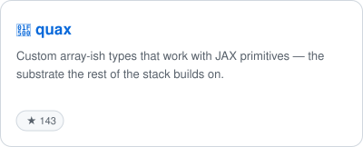
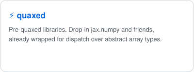
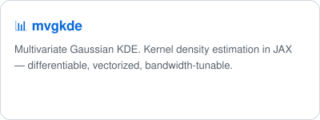
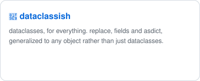
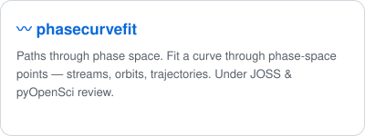

I am a **Brinson Prize Fellow** and postdoctoral associate at the **MIT Kavli Institute for Astrophysics and Space Research**. I work on dark matter — what it is, and how it shapes galaxies — mostly by using stellar streams to constrain their gravitational potentials, in the Milky Way and far beyond it with large-scale surveys. I received my PhD from the University of Toronto.

I also build the scientific software I use. I'm a core developer and Coordination Committee member of [Astropy](https://www.astropy.org), and I wrote much of the JAX-based galactic dynamics ecosystem (see below). I have strong opinions about open-source software in science — it is research infrastructure, and deserves to be built and credited as such.

Ask me about dark matter, differentiable simulation, or cheese.

### 🔗 Links

✉️ starkman [at] mit [dot] edu &nbsp;|&nbsp; 🌐 [nstarman.github.io](https://nstarman.github.io/)

 [**Publications**](https://ui.adsabs.harvard.edu/search/p_=0&q=author%3A%22Starkman%2C%20Nathaniel%22&sort=date%20desc%2C%20bibcode%20desc) &nbsp;|&nbsp;  [**arXiv**](https://arxiv.org/search/advanced?advanced=&terms-0-operator=AND&terms-0-term=Starkman%2C+Nathaniel&terms-0-field=author&classification-physics_archives=all&classification-include_cross_list=include&date-filter_by=all_dates&abstracts=show&size=50&order=-announced_date_first) &nbsp;|&nbsp;  [**Zenodo**](https://zenodo.org/search?q=%22Starkman%2C%20Nathaniel%22%20OR%20%22Nathaniel%20Starkman%22) &nbsp;|&nbsp;  [**ORCID** 0000-0003-3954-3291](https://orcid.org/0000-0003-3954-3291)

### 📄 Select Publications

> 📄 paper · 🔨 paper repo · 💻 code · 📖 docs · 🗄️ data

<table>
<tr>
<td>

Euclid Collaboration, **N. Starkman**, et al. *Euclid: The Geometry of Dark Matter Halos from Extragalactic Streams — a Pilot Study.* Submitted to A&A. arXiv:2606.21774

</td>
<td align="right">

[📄](https://ui.adsabs.harvard.edu/abs/2026arXiv260621774E/abstract)

</td>
</tr>
<tr>
<td>

**N. Starkman**, et al. (2025). *unxt: A Python package for unit-aware computing with JAX.* JOSS 10(107), 7771.

</td>
<td align="right">

[📄](https://doi.org/10.21105/joss.07771) [💻](https://github.com/GalacticDynamics/unxt) [📖](https://unxt.readthedocs.io/en/stable/)

</td>
</tr>
<tr>
<td>

**N. Starkman**, et al. (2025). *Stream Members Only: Data-Driven Characterization of Stellar Streams with Mixture Density Networks.* ApJ 979, 155.

</td>
<td align="right">

[📄](https://iopscience.iop.org/article/10.3847/1538-4357/ad94f2) [🔨](https://github.com/nstarman/stellar_stream_density_ml_paper) [🗄️](https://zenodo.org/records/10211410)

</td>
</tr>
<tr>
<td>

**N. Starkman**, A. Kosowsky, G. Starkman (2024). *Angular Correlations of Cosmic Microwave Background Spectrum Distortions from Photon Diffusion.* MNRAS 529, 2274.

</td>
<td align="right">

[📄](https://academic.oup.com/mnras/article/529/3/2274/7630233) [🔨](https://github.com/nstarman/Temperature-Diffusion-Spectral-Distortion-Paper) [🗄️](https://zenodo.org/record/8400583)

</td>
</tr>
<tr>
<td>

**N. Starkman**, et al. (2023). *Characterizing Stream Tracks and Comparing to Simulation.* MNRAS 522, 2735.

</td>
<td align="right">

[📄](https://doi.org/10.1093/mnras/stad1166) [🔨](https://github.com/nstarman/trackstream_paper) [💻](https://github.com/nstarman/trackstream) [📖](https://trackstream.readthedocs.io/en/latest/) [🗄️](https://zenodo.org/record/7265571)

</td>
</tr>
<tr>
<td>

The Astropy Collaboration, A. M. Price-Whelan, …, **N. Starkman**, et al. (2022). *The Astropy Project: Sustaining and Growing a Community-oriented Open-source Project and the Latest Major Release (v5.0) of the Core Package.* ApJ 935, 167.

</td>
<td align="right">

[📄](https://arxiv.org/abs/2206.14220) [🔨](https://github.com/astropy/astropy-v5.0-paper) [💻](https://github.com/astropy/astropy) [📖](https://www.astropy.org) [🗄️](https://doi.org/10.5281/zenodo.8325470)

</td>
</tr>
</table>

➡️ Full publication list on [**ADS**](https://ui.adsabs.harvard.edu/search/p_=0&q=author%3A%22Starkman%2C%20Nathaniel%22&sort=date%20desc%2C%20bibcode%20desc).

### 💻 Software

<!--
  MAINTENANCE NOTE — software cards
  GitHub's markdown sanitizer strips `style`, `class` and `<style>`, so a CSS
  card grid is impossible here. The cards below are therefore images: one SVG
  per library per colour scheme, picked at view time by <picture>. They flow in
  a plain 
, so they re-wrap from two columns to one on a narrow viewport.

  Regenerated monthly by .github/workflows/refresh-software-cards.yml, which
  re-fetches every star count and opens a commit only if a card changed. Run
  it by hand after editing a blurb or adding a library:

      python3 scripts/make_software_cards.py

  The star pill is driven by the live count, not a flag in the README — a repo
  crossing the threshold (50) gains its pill on the next run with no edit here.
  Thresholds and the galax exemption live in scripts/make_software_cards.py.

  Paths are relative on purpose: GitHub rewrites them to the repo's raw URL on
  the profile page, the repo page and any branch, so they survive a rename and
  render in PR previews.
-->

<a href="https://github.com/astropy/astropy"><picture><source media="(prefers-color-scheme: dark)" srcset="assets/cards/astropy-dark.svg"></picture></a>
<a href="https://github.com/GalacticDynamics/galax"><picture><source media="(prefers-color-scheme: dark)" srcset="assets/cards/galax-dark.svg"></picture></a>
<a href="https://github.com/GalacticDynamics/unxt"><picture><source media="(prefers-color-scheme: dark)" srcset="assets/cards/unxt-dark.svg"></picture></a>
<a href="https://github.com/GalacticDynamics/coordinax"><picture><source media="(prefers-color-scheme: dark)" srcset="assets/cards/coordinax-dark.svg"></picture></a>
<a href="https://github.com/nstarman/quax"><picture><source media="(prefers-color-scheme: dark)" srcset="assets/cards/quax-dark.svg"></picture></a>
<a href="https://github.com/GalacticDynamics/quaxed"><picture><source media="(prefers-color-scheme: dark)" srcset="assets/cards/quaxed-dark.svg"></picture></a>
<a href="https://github.com/nstarman/mvgkde"><picture><source media="(prefers-color-scheme: dark)" srcset="assets/cards/mvgkde-dark.svg"></picture></a>
<a href="https://github.com/GalacticDynamics/dataclassish"><picture><source media="(prefers-color-scheme: dark)" srcset="assets/cards/dataclassish-dark.svg"></picture></a>
<a href="https://github.com/GalacticDynamics/jaxmore"><picture><source media="(prefers-color-scheme: dark)" srcset="assets/cards/jaxmore-dark.svg"></picture></a>
<a href="https://github.com/GalacticDynamics/phasecurvefit"><picture><source media="(prefers-color-scheme: dark)" srcset="assets/cards/phasecurvefit-dark.svg"></picture></a>

<i>Click to expand:</i> the rest of the ecosystem — JAX tooling, Python micro-libraries, and science codes.

 

**JAX / array computing**

- [**quax-blocks**](https://github.com/GalacticDynamics/quax-blocks): building blocks for constructing `quax` classes — mixins for arithmetic, comparison, and array protocols.
- [**diffraxtra**](https://github.com/GalacticDynamics/diffraxtra): extras for Diffrax — OOP interfaces and vectorization.
- [**oncequinox**](https://github.com/GalacticDynamics/oncequinox): singletons for Equinox.
- [**xmmutablemap**](https://github.com/GalacticDynamics/xmmutablemap): an immutable mapping, JAX-compatible.

**Python micro-libraries**

- [**optional_dependencies**](https://github.com/GalacticDynamics/optional_dependencies): construct checks for optional dependencies.
- [**plotting_backends**](https://github.com/GalacticDynamics/plotting_backends): dispatch over plotting backends.
- [**is_annotated**](https://github.com/GalacticDynamics/is_annotated): check whether a type hint is `Annotated`.
- [**zeroth**](https://github.com/GalacticDynamics/zeroth): efficiently get the index-0 element of any iterable.

**Science codes**

- [**trackstream**](https://github.com/nstarman/trackstream): characterize a stellar stream's track with minimal prior knowledge. Astropy-powered.
- [**macro_lightning**](https://github.com/nstarman/macro_lightning): constrain macroscopic dark matter with lightning, on Earth and Jupiter.
- [**galactic_dynamics_interoperability**](https://github.com/GalacticDynamics/galactic_dynamics_interoperability): interoperability between galactic dynamics libraries.

